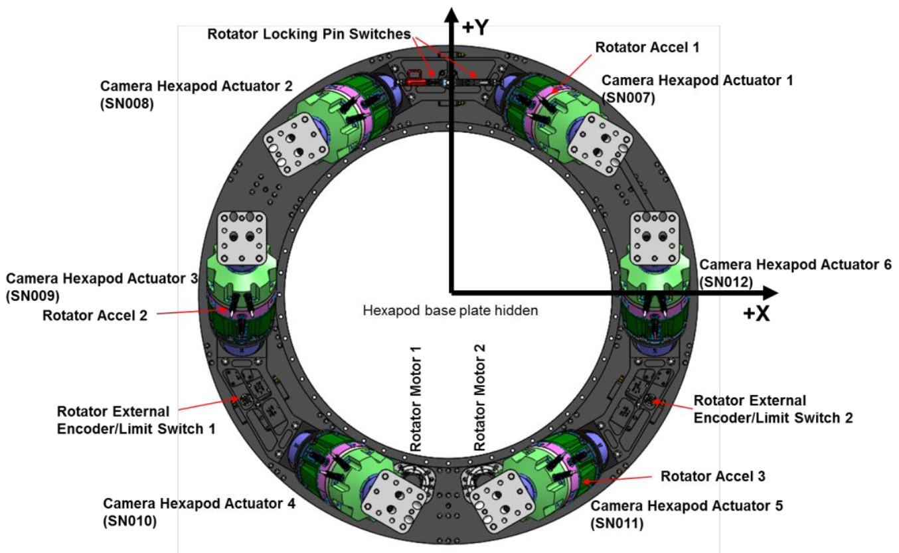
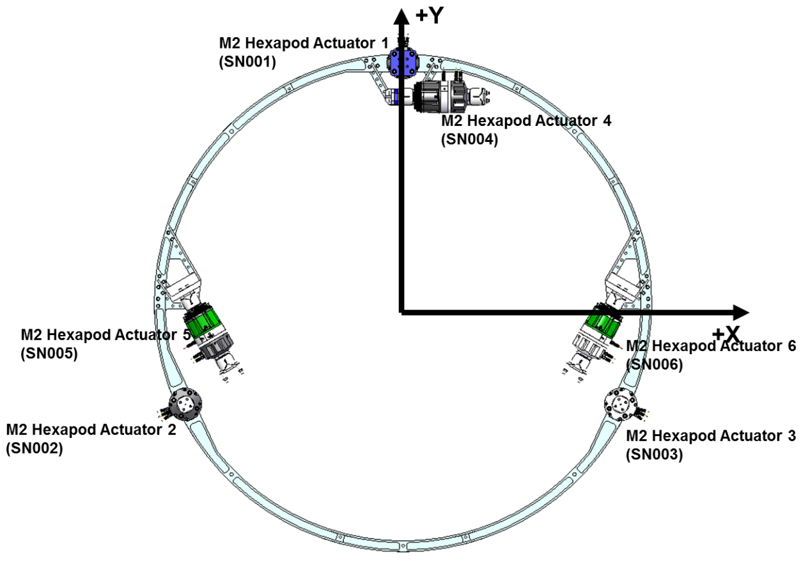

.. py:currentmodule:: lsst.ts.mthexapod

.. _lsst.ts.mthexapod.kinematics:

###############
Kinematics
###############

The kinematics of the hexapod are explained here based on the **hexapod_kin_calc.slx** in `ts_mt_hexRot_simulink <https://github.com/lsst-ts/ts_mt_hexRot_simulink>`_.
The inverse kinematics is used to transform the hexapod positions :math:`(x, y, z, r_{x}, r_{y}, r_{z})` to 6 delta strut lengths from the origin.
The forward kinematics is to transform the 6 delta strut lengths to the hexapod positions.

.. _lsst.ts.mthexapod.kinematics-inverse:

Inverse Kinematics
==================

As a typical hexapod with 6 struts, define their positions on the base are:

.. math::
    \vec{p}_{\text{base}} = (\vec{p}_{\text{base, 1}}, \vec{p}_{\text{base, 2}}, \cdots, \vec{p}_{\text{base, 6}})

, where :math:`\vec{p}_{\text{base, n}} = (x_{n}, y_{n}, z_{n})` is the position of each strut :math:`n`.
Define their positions on the mirror to be:

.. math::
    \vec{p}_{\text{mirror}} = (\vec{p}_{\text{mirror, 1}}, \vec{p}_{\text{mirror, 2}}, \cdots, \vec{p}_{\text{mirror, 6}})

Since the hexapod can do the translation :math:`(x, y, z)` and rotation :math:`(r_{x}, r_{y}, r_{z})`, the related rotation center is defined to be the pivot, :math:`\vec{p}_{\text{v}} = (p_{\text{x}}, p_{\text{y}}, p_{\text{z}})`.

If the hexapod moves the position :math:`(x, y, z)` from the origin, the related strut change from the pivot is:

.. math::
    \Delta \vec{d}_{\text{trans}} = (x+p_{x}, y+p_{y}, z+p_{z})

For the rotation :math:`(r_{x}, r_{y}, r_{z})`, define the rotationr matrix to be: :math:`R_{xyz} = R_{x}(r_{x})R_{y}(r_{y})R_{z}(r_{z})`.
The related strut change is:

.. math::
    \Delta \vec{d}_{\text{rot}} = R_{xyz} (\vec{p}_{\text{base}} - \vec{p}_{\text{v}})

The strut change in the translation and rotation directions from the mirror is:

.. math::
    \begin{aligned}
    \Delta \vec{d} &= \Delta \vec{d}_{\text{trans}} + \Delta \vec{d}_{\text{rot}} - \vec{p}_{\text{mirror}} \\
    &= \begin{pmatrix}
       \Delta d_{1, x}, \Delta d_{2, x}, \cdots, \Delta d_{6, x} \\
       \Delta d_{1, y}, \Delta d_{2, y}, \cdots, \Delta d_{6, y} \\
       \Delta d_{1, z}, \Delta d_{2, z}, \cdots, \Delta d_{6, z}
       \end{pmatrix}
    \end{aligned}

Consider the strut change for each x, y, and z component, the total strut change is: :math:`\vec{s}=(s_{1}, s_{2}, \cdots, s_{6})`, where each component :math:`n` is:

.. math::
    s_{n}=\sqrt{(\Delta d_{n,x}^{2} + \Delta d_{n,y}^{2} + \Delta d_{n,z}^{2})}

The norminal stuct change between the base and mirror is:

.. math::
    \vec{s}_{\text{norm}} = \|\vec{p}_{\text{base}} - \vec{p}_{\text{mirror}}\| = (\|s_{\text{norm, 1}}\|, \|s_{\text{norm, 2}}\|, \cdots, \|s_{\text{norm, 6}}\|)

Finally, the delta strut change is:

.. math::
    \Delta\vec{s} = \vec{s} - \vec{s}_{\text{norm}}

See the full calculation in ``SimpleHexapod.inverse_kinematics()`` of `simple_hexapod.py <https://github.com/lsst-ts/ts_mthexapod/blob/develop/python/lsst/ts/mthexapod/simple_hexapod.py>`_.

.. _lsst.ts.mthexapod.kinematics-forward:

Forward Kinematics
==================

To calculate the hexapod positions, the `Nelder-Mead method <https://en.wikipedia.org/wiki/Nelder%E2%80%93Mead_method>`_  is used to minimize the difference between the estimated and current delta strut lengths with the initial guess of current hexapod positions.
See the full calculation in ``SimpleHexapod.forward_kinematics()`` of `simple_hexapod.py <https://github.com/lsst-ts/ts_mthexapod/blob/develop/python/lsst/ts/mthexapod/simple_hexapod.py>`_.

.. _lsst.ts.mthexapod.kinematics-hexapod-types:

Hexapod Types
=============

There are two hexapods on the main telescope: camera hexapod and M2 hexapod.
See the following figures for these two hexapods:

  Coordinate system and actuator locations/numbering for camera hexapod.

  M2 hexapod coordinate system and actuator locations/numbering for the M2 hexapod.

The related base and mirror positions are recorded in the `constants.py <https://github.com/lsst-ts/ts_mthexapod/blob/develop/python/lsst/ts/mthexapod/constants.py>`_ as a reference.

You can see their mechanical structures are different.
For the camera hexapod, 6 struts move together to do the z-axis movement.
However, for the same movement, the M2 hexapod only uses the struts 1-3.
In addition, for the x-axis movement, the M2 hexapod uses the struts 4-6.
The strut 4 contributes most of this moving.
For the y-axis movement, the M2 hexapod uses the struts 5 and 6 only, and the strut 4 is not used.
